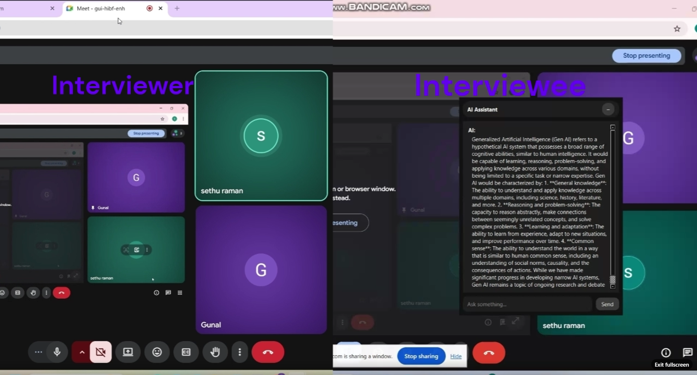

# 🕵️‍♂️ AI Interview Cracker: The Ultimate \"Cheat Code\"


Welcome to the **AI Interview Cracker**! Ever wished you had a tiny, invisible friend sitting on your shoulder during a nail-biting online interview, whispering the perfect answers directly into your ear? Well, grab your popcorn, because this is exactly what we built! 🍿

This project is your ultimate, floating, always-on-top sneaky AI assistant designed to help you crush interviews. It's built with a sleek **PySide6 Frontend** (a floating chat bubble widget) and a brainy **FastAPI + LangChain Backend** that knows *both* general AI/ML concepts and your very own resume!

---

## 🎭 The \"Fun Cheating\" Interview Flow

Here is how the magic happens when you are in the hot seat:

1. **The Stealthy Bubble**: You launch the app. A tiny, translucent bubble appears on your screen. Because it’s programmed with `Qt.WindowStaysOnTopHint`, it hovers stealthily over your Zoom, Teams, or Google Meet window.
2. **The Double-Click Assault**: The interviewer asks a tough question. *Panic?* No! You casually double-click the bubble.
3. **The Interrogation**: A dark-themed, frameless chat window pops out. You type (or paste) the question.
4. **The Brainy Rescue**: The AI thinks for a second, and *BOOM!* the perfect answer appears. You confidently read it out like the genius you are. 🥷✨

---

## 🧠 How the Magic Works (The Tech Side)



Let's dive into the guts of this beast. It's essentially a beautiful marriage between a desktop UI and an intelligent RAG (Retrieval-Augmented Generation) pipeline.

### 🎨 Frontend: The Ninja UI (`/frontend`)
- **Tech Stack**: PySide6 (Qt for Python), Requests.
- **`app.py` & `bubble.py`**: Boots up a floating, frameless circular widget that acts as your anchor. You can drag it anywhere so it doesn't block your interviewers' faces!
- **`chat.py`**: The actual chat interface. It runs asynchronously using QThreads so your UI never freezes while the backend is \"thinking\".
- **`api.py`**: The messenger pigeon that sends your panicked questions to the local backend.

### ⚙️ Backend: The Brains (`/backend`)
- **Tech Stack**: FastAPI, LangChain, Groq (Llama-3.1-8b), FAISS (Vector Database), Sentence-Transformers.
- **`app/main.py`**: A blazing-fast FastAPI server that exposes a simple `/ask` endpoint.
- **`app/rag_logic.py` (The RAG Routing)**: This is where it gets spicy 🌶️! When you ask a question, an LLM classifier first decides: *\"Is this a question about the candidate's resume, or a general AI/ML question?\"*
    - **General Question?** It routes to a standard LLM prompt and gives you a concise technical answer.
    - **Resume Specific?** It triggers the RAG pipeline, searches the local FAISS database for your resume details, and answers using *your* context. No hallucinating past jobs!

---

## 🛠️ Grounding It to YOUR Resume & Role

The true power of this bot is the RAG (Retrieval-Augmented Generation) pipeline. Here is how you can ground this bot to make it *your* personal clone for a specific role:

1. **Drop Your Resume**: Take your shiny `resume.pdf` (tailored to the specific role you are applying for) and drop it into `backend/data/`.
2. **Build the Brain**: Run the `build_vectorstore.py` script.
   ```bash
   cd backend
   python build_vectorstore.py
   ```
   *What happens here?* The script uses `PyPDF` to extract text from your resume, chunks it up using LangChain's `RecursiveCharacterTextSplitter`, generates vector embeddings via `SentenceTransformer`, and saves it as a FAISS index (`resume_faiss.pkl`).
3. **Role Specific Prompts**: You can easily tweak the `general_prompt` or `resume_prompt` inside `rag_logic.py` to adopt the persona of the exact role you are interviewing for (e.g., *\"You are a Senior Data Engineer interviewing at Google...\"*).
4. **Crush It**: Start the backend and frontend, and you now have a personal assistant grounded entirely on your career history!

> **Disclaimer**: The \"cheating\" aspect is purely for fun storytelling and educational purposes (building awesome RAG + Desktop apps). Use your newfound powers responsibly! 😉 

Happy Coding and Good Luck Cracking Those Interviews! 🚀
